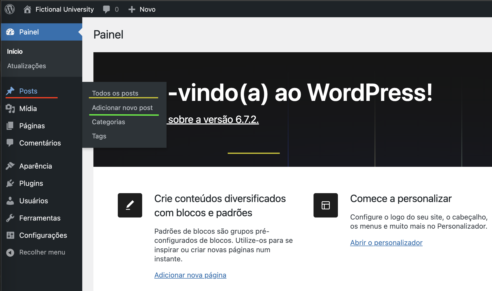
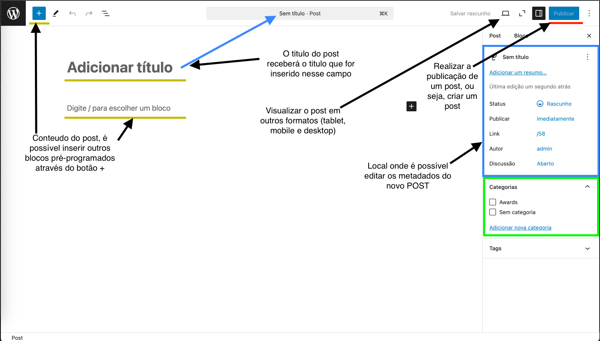

# Wordpress

## O que é o wordpress?
- É um sistema de gerenciamento de conteúdo (CMS - Content Management System) que permite criar e administrar sites, blogs, lojas virtuais, e muito mais. É gratuito e de código aberto, por esse motivo, é a plataforma mais utilizada no mundo.
- Exmplos de CMSs:
  - Wordpress - (O mais popular do mundo)
  - Wix
  - Shopfy
  - Joomla
  - Drupal
- O Wordpress é baseado em PHP, MySQL e MariaDB, executando em um servidor interpretador.
- Aplicações: Blogs, sites empresariais, e-commerces, fóruns, redes sociais e etc.
- Existem o wordpress.com e o wordpress.or
  - O Wordpress.com é o sistema de criação e hospedagem próprio do wordpress, mais simples e limitado, porém não há necessidade de aprendizagem em programação.
  - Wordpress.org é o software gratuito e de código aberto, tendo liberdade total e acesso a todas as funcionalidades do wordpress.
- Temas: Os temas são basicamente modelos pré-definidos do wordpress. Eles determinam o visual das paginas, posicionamento de conteudos e muito mais.
- Plugins: Os plugins são extesões que adicionam funções especificas ao site, como por exemplo, formularios, melhorar desempenho e integrar serviço de terceiros como o google analitcs. Alguns plugins podem ser pagos.
- Editor Gutenberg: Basicamente se refere ao editor de blocos padrão do wordpress. Cada bloco pode ser um texto, uma imagem, um video ou outro elemento. Sistema de arrasta e solta.
- O wordpress foi inteiramente adaptado para práticas de SEO, mas também existem plugins de SEO

## Themes
- Para criar um novo tema basta entrar na pasta de temas localizada geralmente em app/public/wp-content/themes e criar uma nova pasta para o novo tema.
- O arquivo principal do tema será o index.php na raiz da pastas
- Nomear tema, informações de autor e versão: Na raiz da pasta do tema criar o arquivo style.css (Muito importante ser esse nome), e no topo do documento comentar as informações principais.
```
/*
    Theme Name: Fictional University 
    Author: Jonathan
    Version: 1.0
*/
```
- Para definir uma imagem para o tema no WP basta criar um arquivo de imagem na raiz do tema e inserir o nome de screnshot.png

- Funções pré-programadas em PHP:
  - bloginfo(): Captura as principais informações da aplicação como nome e descrição
  - have_posts(): Geralmente utilizado no loop while, o have_posts permite que o while continue rodando enquanto existem posts para recorrer, nesse caso, os posts se tratam dos posts da aba posts do wordpress;
    - the_post(): Indica que o post será exibido.
    - the_title(): Indica o titulo do post.
    - the_content(): Indica o conteudo do post.
    - the_permalink(): Retorna o link de acesso ao post especifico, sendo utilizado dentro da tag `<a>`;
      ```
      // Atenção, por padrão o wordpress quando esse comando for utilizado na homepage tratá do banco de dados os 10 ultimos posts criados.
      <?php
        while(have_posts()) {
          the_post(); ?>
          <h2><a href="<?php the_permalink(); ?>"><?php the_title(); ?></a></h2>
          <?php the_content(); ?>
          <hr>
          <?php 
        }
        ?>
      ``` 
  - get_footer()/get_header(): Capturam o conteudo dos arquivos footer.php e header.php criados na raiz do tema. Para inseri-los em todos os posts ou paginas basta aplicar o comando get_header ou get_footer no topo e no fim do documento.
  - wp_head(): Utilizada no arquivo header.php, mais especificamente dentro da tag head, ela permite que o wordpress tenha controle total da seção head da página onde o mesmo descarrega arquivos de estilos e arquivos de plugin. Resumindo, carrega todo tipo de configuração no head da pagina.
  - wp_enqueue_style(): Esta função do WordPress é usada para adicionar arquivos CSS ao site. Recebe dois parâmetros o primeiro é o handle do arquivo ou identificador unico que será utilizado pelo wordpress, e o segundo geralmente é o get_stylesheet_uri(), o qual captura o arquivo principal de estilos da raiz do tema.
- Para obter um modelo de template de posts individuais basta criar na raiz do tema um arquivo chamado single.php.
- Para obter um modelo de template de paginas individuais basta criar na raiz do tema um arquivo chamado page.php.

- Arquivo functions.php: O arquivo functions.php é um arquivo privado criado na raiz do tema

## Learning Path Content
- Introduction
  - Course Wordpress:
- Basic concepts
  - Sintaxe básica de PHP e funcionamento básico da linguagem
    - [Documentação PHP](https://www.w3schools.com/php/)
  - Painel Wordpress, criar posts, configurar permalinks e etc
    - 
      - Vermelho: Aba de posts, abaixo e acima dela é possivel ver as demais abas de outros tipos de POST, configurações e ferramentas do painel do wordpress
      - Amarelo: Visualiza todos os posts
      - Verde: Adiciona um novo post 
    - 
  - Post Type e principais tipos de POST (post, page, nav_menu_item)
    - IMPORTANTE: Um post também é um tipo de POST
    - Todos os POSTS são armazenados na tabela wp_posts e diferenciados na coluna post_type
    - Além do tipo de Post Padrão, é possível criar tipos de postagens personalizadas
    - Tipos mais comuns de POSTS
      - Postagem (Tipo de postagem: 'postagem')
      - Página (Tipo de postagem: 'página')
      - Anexo (Tipo de postagem: 'anexo')
      - Revisão (Tipo de postagem: 'revisão')
      - Menu de navegação (Tipo de postagem: 'nav_menu_item')
      - Modelos de bloco (Tipo de postagem: 'wp_template')
      - Partes do modelo (Tipo de postagem: 'wp_template_part')
  - Conceito Taxonomia e principais taxonomias (Categorias, tags e taxonomias personalizadas):
    - Categorias, tags e taxonomias estão todas relacionadas e podem confundir, então como exemplo é utilizado uma página de receita.
    - (Exemplificando) Em nosso site de receitas as categorias seriam 
      - Café da manhã
      - Almoço
      - Jantar
      - Aperitivos
      - Sopas
      - Saladas
      - Acompanhamentos
      - Sobremesas
    - Tags representam outro nível de especificidade, que fornece significado ao usuário como por exemplo:
      - Chocolate
      - Gengibre 
      - Frango
    - A respeito das taxonomias, na verdade, Categorias e tags são exemplos de taxonomias, que são simplesmente uma forma de organizar o conteudo.
    - Taxonomias são o método de classificação de conteúdo e dados no wordpress, ao usar taxonomias é agrupado elementos semelhantes, e a taxonomia se refere a soma desses grupos, assim como a taxonomia na biologia, que classifica e descreve os seres vivos e os coloca em grupos.
    - Categorias e tags são taxonomias padrão do Wordpress, mas é possivel criar uma nova taxonomia de acordo com a necessidade.
    - Por fim existem os `termos || terms`, que são itens dentro da sua taxonomia.
  - Loop e como funciona(Uso de variáveis globais $wp_query e $post, função wp_query)
    - Loop em Wordpress é um código PHP que é utilizado para exibir posts de acordo com critérios especificados nas tags do Loop. 
    - Exemplo básico de loop
      ```
        <?php 
          /*
            Primeiramente o sistema verifica se existem posts
            A função have posts é uma função do wordpress que realiza um query do banco de dados e verifica se existem posts, podendo retornar true or false dependendo do resultado
          */
          if ( have_posts() ) { 
            /*
              Enquanto houver posts ele continuará renderizando item por item dos posts encontrados
            */
            while ( have_posts() ) {
              the_post(); // The post representa o post em sí, ou sejam cada item do post
              /*
                Neste ponto é possível fazer qualquer coisa quando a posts, tendo em vista que todo o conteúdo desse local estará dentro do while.
                Então é possível utilizar HTML pra renderizar e deixar da forma que desejar
              */
            } // end while
          } // end if
          ?>
      ```
    - Com loop também é possivel renderizar conteudos de acordo com a categoria daquele momento, utilizando um expressão condicional IF com o método in_category('category');
  - WP_query{}:
    ```
      - WP_query é uma classe do wordpress que é utilizada para realizar QUERYs em banco de dados do wordpress
      - Por padrão, todos arquivos (single, index, archive, etc) possuem uma classe WP_query padrão a qual caputura algumas informações sobre
      post_type do arquivo e posts_per_page (que por padrão é 10). 
      - A classe WP_Query possui métodos que são utilizados para renderizar posts e manipular loops, como have_posts, the_post, the_title etc
      - Essa classe pode ser alterada instanciando a mesma e passando o array de informações ($queryArrayEvent), isso fará com que a WP_Query
      padrão seja alterada para a que for criada. Por boas práticas é sempre interessante resetar a classe padrão com o método wp_reset_postdata();
      
      $queryArray = array(
        'posts_per_page' => 2
      // 'category_name' => 'awards'
      );
      $homepageposts = new WP_Query($queryArray);
    ``` 
- Basic content 
  - Hierarquia de temas e arquivos
    - O Wordpress possue uma estrutura hierarquica bem definida
      - Para posts:
        1. single-post-meu-post.php: Quando este post especifico do tipo "post" for renderizado utilizará esse arquivo como template
        2. single-post.php: Arquivo template para post do tipo "post"
        3. single.php: Arquivo template para qualquer tipo de post
        4. singular.php: Arquivo template para qualquer conteudo individual (page ou post)
        5. index.php: Fallback final
      - Para uma pagina com o slug `sobre`:
        1. page-sobre.php: Primeiro procura um arquivo `page-<pageName>.php` para usar de template
        2. page-23.php: Procura um arquivo que contenha `page-<id>.php` para usar de template
        3. page.php: Arquivo padrão para todos os pages
        4. singular.php: Arquivo geral para todos os conteudos isolados
        5. index.php: Fallback final
      - Para uma categoria chamada `Noticias`:
        1. category-noticias.php: Procura um arquivo de modelo `category-<name>.php`
        2. category-5.php: Procura um arquivo de modelo `category-<id>.php`
        3. category.php: Arquivo padrão para a renderização de categorias
        4. archive.php: Arquivo padrão para a renderização de Taxonomias e posts personalizados
        5. index.php: Fallback Final
  - Criando e customizando menus
    - No Wordpress um menu é tratado como um tipo de post "nav_menu_item", eles são ligados a um menu maior chamado `nav_menu`.
    - Para criar um menu novo, basta ir no arquivo functions e configurar o novo menu a partir do método a baixo:
      ```
        /*
          register_nav_menu(): Registrar um menu de navegação
          Arguments: 
            Nome para o menu específico
            Nome que aparecerá no painel de administração do wordpress
          Esse método precisa estar associado a um `add_action` com o hook (init) ou (after_setup_theme)
        */
        register_nav_menu('headerMenuLocation', 'Header Menu Location');
        
        
        /*
          Após registrado basta configurá-lo no painel wp-admin e para chamá-lo basta utilizar: 
            wp_nav_menu(array(
              'theme_location' => 'headerMenuLocation'
            ));
          Utilizado geralmente no header e no footer.

          has_nav_menu(): verificar se existe um menu
        */
      ```
    - Para registrar mais de um menu por vez
      ```
          function register_my_menus() {
            register_nav_menus(
              array(
                'header-menu' => __( 'Header Menu' ),
                'extra-menu' => __( 'Extra Menu' )
              )
            );
          }
          add_action( 'init', 'register_my_menus' );
      ``` 
  - Criar posts customizados
    - Como vimos anteriormente, posts na verdade são tipos especificos de elementos que indicam um certo conteudo, como uma página, uma postagem, revision, menu ou anexos.
    - No wordpress também é possivel a criação de post_types personalizados de acordo com a necessidade. Para criar um novo post_type é simples, mas, por garantia, devemos criá-lo fora do tema para que o mesmo seja utilizado a qualquer momento independente do tema presente.
    - Então neste caso vamo utilizar o método "Must-Use Plugins" que são um tipo especial de plugin no wordpress. **Carregam automaticamente**, sem precisar ser ativados no painel do wordpress. Usados quando queremos garantir que certas funcionalidades estejam sempre ativas, sem chance do usuário desativar.
    - Cenários em que o "Must-Use Plugins" geralmente é utilizado:
      - Coisas críticas para o funcionamento do site
      - Código que não faz sentido ser desativado
      - Funcionalidades personalizadas em ambientes corporativos/multisite
      - Scripts de segurança, performance ou integrações obrigatorias
      - Automatizações internas, rotinas do time dev, etc.
      - Criar e manter post_types personalizados. <- (Nosso caso)
    -  Para criarmos um novo post_type utilizando o Must-Use basta ir na pasta wp_content e criar uma nova pasta chamada `mu-plugins`. Dentro desta pasta basta criar um arquivo .php (para fins informativos ->) indicando o tema e a finalidade do arquivo.
    -  Dentro dele basta inserir funções com add_action para inicializar uma função especifica.
    -  Neste caso iremos criar um novo post_type, estão teremos um `add_action` que será acionado com o hook init:
      ```
        add_action('init', 'university_post_types');
      ```
    - Neste mesmo arquivo criaremos uma função para inserir novos tipos de post que se chamará `university_post_types`.
    - Dentro dessa funçao executaremos um método do wordpress chamado `register_post_type`, esse método recebe 2 parâmetros, o primeiro é o nome do post_type criado, e o segundo é um array com as informações pertinentes ao post_type:
      ```
        function university_post_types() {
          register_post_type('event', array(
            'supports' => array( // Habilita funcionalidades para o novo tipo de post, como titulo, editor e resumo (trecho)
              'title', 
              'editor', 
              'excerpt'
            ),
            'rewrite' => array(
              slug' => 'events'
            ),
            /*
                Habilitar uma página de arquivos (uma listagem) para o custom type
                Ou seja, habilitar o /post_type para listar todos os items do custom type
            */
            'has_archive' => true,
            /*
                'show_in_rest': Para utilizar a tela moderna do editor de blocos
                Por padrão vem false, caso seja false, todos os posts serão exibidos no editor antigo
                Para utilizar o editor de blocos novo é necessário que na lista de SUPPORTS possua o editor
            */
            'show_in_rest' => true,
            'public' =>  true, // Esse item do array tornará o tipo de postagem visível para editores e visualizadores do site.
            'labels' => array( // Define os parâmetros de rotulo como o nome e configuração do painel wp
                'name' => 'Events', // Altera o nome da seção do Painel para Events
                'add_new_item' => 'Add New Event', // Altera o botão add_new_item para Add New Event
                'edit_item' => 'Edit Event', // Altera o botão edit_item para Edit Event
                'all_items' => 'All events', // Altera o botão all_items para All Events
                'singular_name' => 'Event'
            ),
            /*
                Site para captura de icones do wordpress: https://developer.wordpress.org/resource/dashicons/#buddicons-groups
                menu_icon: se trata do icone do painel wordpress
            */
            'menu_icon' => 'dashicons-calendar'
                ));
            }
      ``` 
  - Criar taxonomias customizadas
    - Assim como post_types personalizados, as taxonomias vão seguir a mesma linha de criação. Taxonomias tem a função de auxiliar na organização de conteudos de post_types com mais assertividade. Por exemplo, para um post_type 'Eventos' por exemplo, é possível que dentre esses eventos, possuam reuniões, seminários, confraternizações etc., para isso, eles são organizados em taxonomias.
    - Para criar uma taxonomias customizada é possível criar direto no arquivo `functions.php` ou no modo "Must-Use"
  - Plugin ACF e quando utilizar
  - Incluir CSS e JS usando enqueue
- Medium content
  - WP_QUERY e Query loop (Como o wordpress puxa os posts)
  - Como salvar um metadado customizado em um post (custom field)
  - O que são e como acessar os metadados de um post (e custom fields)
- Advanced content 
  - Ajax Function wordpress
  - Gutenberg Blocks(outra maneira de fazer temas componentizados no wordpress)
- Extra content
  - Segurança do wordpress e vulnerabilidades comuns
  - Boas práticas de wordpress

## Documentações
- Documentação Oficial:
  - [Documentação oficial do wordpress](https://developer.wordpress.org/).
- Documentação Pessoal:
  - 